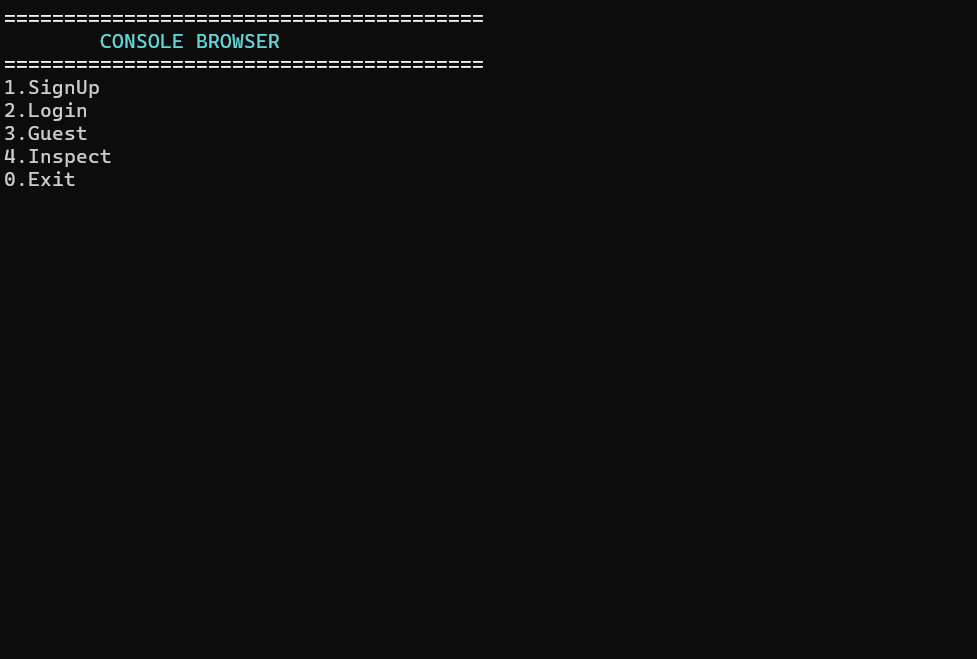
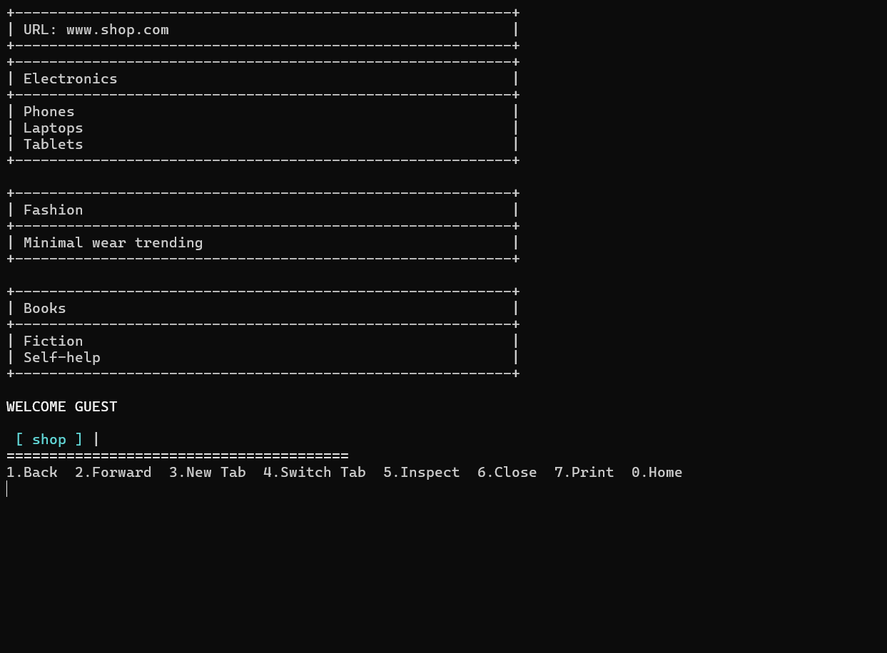
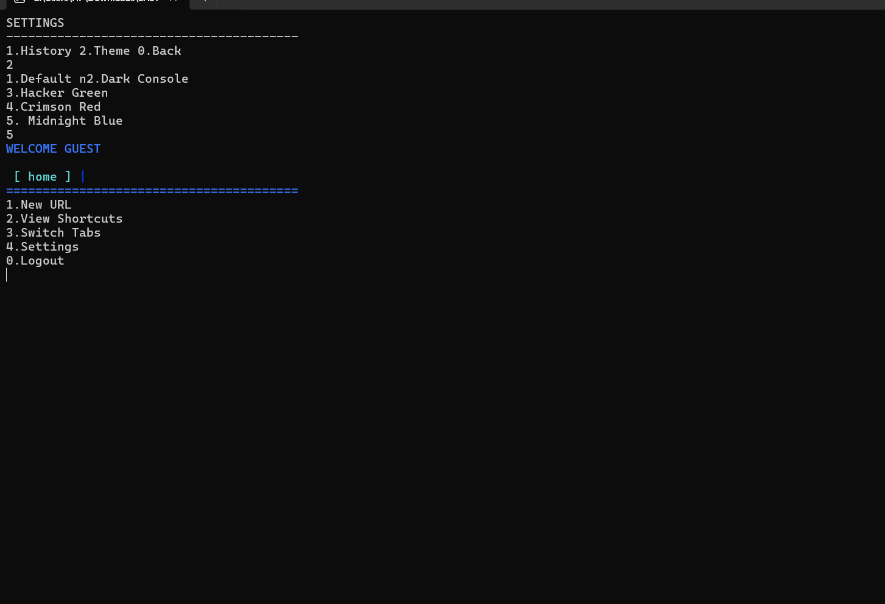
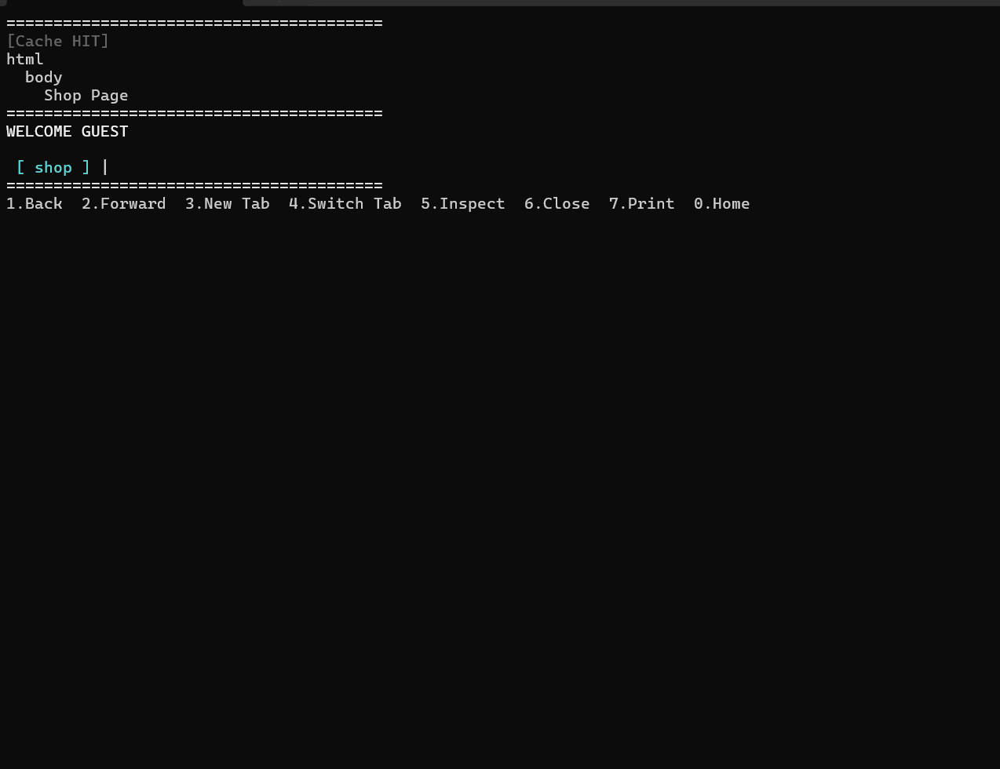

# Browser Simulation

A console-based browser engine simulation built in **C++** designed to explore how modern web browsers work internally.

Rather than focusing only on the user interface, this project models the core architectural components of a browser, including request processing, caching, DOM parsing, rendering, history navigation, and tab management using Object-Oriented Programming (OOP) principles.

The goal is to understand browser internals through practical implementation and system design.

---

## Why This Project?

Modern browsers such as Chrome and Firefox are highly sophisticated systems composed of multiple interacting layers:

* Browser Engine
* Rendering Pipeline
* Cache Management
* DOM Parsing
* History Navigation
* Tab Management
* Request Processing

This project was built to gain hands-on experience with these concepts by simulating how a browser processes and renders content.

---

## Screenshots

### Console Browser



### Browser Interface



### Browser Settings



### Cache System



---

## Browser Request Pipeline

```text
User enters URL
        │
        ▼
 Request Processing
        │
        ▼
 Browser Engine
        │
        ▼
 Cache Lookup
    ┌──────────────┐
    │              │
    ▼              ▼
 Cache Hit     Cache Miss
    │              │
    │         Fetch from
    │        Page Database
    └──────┬───────┘
           ▼
      DOM Parsing
           │
           ▼
   HTML Rendering Layer
           │
           ▼
      WebPage Factory
           │
           ▼
     Render Final Page
```

---

## System Architecture

```text
main.cpp
   │
   ▼
Browser Engine
   │
   ├── UserManager
   │      └── Authentication + File Handling
   │
   ├── RequestPipeline
   │      ├── Cache (LRU-style simulation)
   │      └── PageDatabase
   │
   ├── DOMParser
   ├── HTMLRenderer
   │
   ├── WebPage Factory
   │      ├── NewsPage
   │      ├── SportsPage
   │      ├── ShopPage
   │      ├── CalendarPage
   │      ├── QuotesPage
   │      └── GamePage
   │
   └── Tab & History Management
          ├── Circular Doubly Linked List
          └── Doubly Linked List
```

---

## Key Features

* Console-based browser simulation
* Browser request pipeline modelling
* Cache hit / cache miss mechanism
* Browser rendering flow simulation
* Multi-tab browser support
* Back and forward history navigation
* User authentication using file handling
* DOM parsing and rendering simulation
* Interactive browser pages (News, Sports, Shop, Quotes, Calendar, Game)
* Themed console output system

---

## Browser Concepts Explored

* Browser Engine workflow
* Rendering pipeline
* Cache systems
* Request processing lifecycle
* DOM parsing and rendering
* Browser history management
* Multi-tab architecture
* Layered software architecture

---

## OOP Concepts Implemented

| Concept        | Implementation                             |
| -------------- | ------------------------------------------ |
| Abstraction    | `WebPage` abstract class                   |
| Inheritance    | `NewsPage`, `SportsPage`, `ShopPage`, etc. |
| Polymorphism   | Runtime rendering using `render()`         |
| Encapsulation  | Cache, HistoryManager, UserManager         |
| Templates      | `Tab<T>` implementation                    |
| Factory Method | Dynamic page creation                      |
| Composition    | Browser built using multiple subsystems    |

---

## Data Structures Used

* `std::map` → Page database and cache lookup
* Doubly Linked List → Browser history navigation
* Circular Doubly Linked List → Multi-tab management

---

## Technologies Used

* C++17
* Object-Oriented Programming (OOP)
* File Handling
* Data Structures
* HTML/CSS/JavaScript (front-end simulation)

---

## Project Goals

* Understand browser internals through implementation
* Apply OOP principles to a real-world system
* Explore modular software architecture
* Simulate browser request and rendering behaviour

---

## How to Run

### Clone the Repository

```bash
git clone https://github.com/rathoremahee21/Browser-Simulation.git
```

### Build and Run

```bash
g++ main.cpp -o browser
./browser
```

Or open the project in VS Code, CodeBlocks, or any C++ IDE and compile using a C++17 compatible compiler.

---

## Current Limitations

* No real internet access (predefined pages only)
* Windows-focused implementation
* Passwords stored in plaintext (educational purposes only)
* No CSS rendering engine
* No JavaScript execution engine
* No multimedia support

---

## Future Improvements

* Real HTTP request handling
* Advanced browser engine simulation
* Secure password hashing
* Cross-platform compatibility
* GUI-based browser version
* Enhanced rendering pipeline simulation

---

## Learning Outcomes

This project provided practical experience with:

* Browser architecture fundamentals
* OOP-based system design
* Data structures in real-world applications
* Modular software engineering
* Cache management systems
* Request lifecycle modelling

---

## Author

**Anushka Lal Mahee Rathore**

GitHub: https://github.com/rathoremahee21
